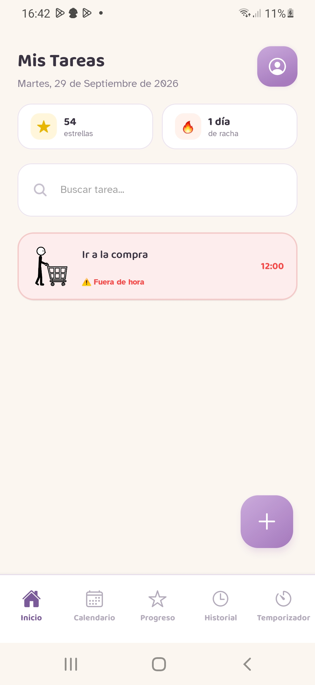
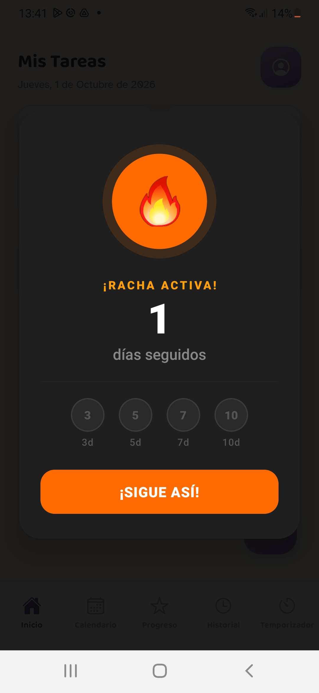

# RutinaQuest

App móvil de rutinas gamificada para que cualquier persona pueda organizar su día, diseñada con especial cuidado para **personas con discapacidad intelectual**.

Proyecto de fin de ciclo de Desarrollo de Aplicaciones Multiplataforma (DAM). Nace de mis años como educadora social: uno de los mayores retos del día a día era la autonomía, que cada persona pudiera seguir su rutina y sentir que tenía el control de su tiempo.

Sin registro, sin anuncios y sin servidores: los datos se quedan en el móvil.

📲 **Descarga el APK para Android:** [ENLACE A DRIVE]

<!-- Añade aquí 3 o 4 capturas de la app -->
<p align="center">
  
  
  
</p>

---

## Accesibilidad

- Tareas con **pictogramas de ARASAAC**, el sistema de comunicación aumentativa más usado en España.
- Tipografía **Atkinson Hyperlegible**, diseñada para personas con baja visión.
- El texto se adapta al tamaño de letra configurado en el móvil.
- Compatible con los lectores de pantalla **TalkBack** y **VoiceOver**.
- **Vibración** como respuesta en las acciones principales.

## Funcionalidades

| Pantalla | Descripción |
|---|---|
| Tareas | Tareas diarias con pictogramas, prioridades y temporizador |
| Calendario | Vista semanal del historial de actividad |
| Progreso | Estrellas, racha diaria y medallas (bronce, plata y oro) |
| Historial | Registro de tareas completadas con búsqueda |
| Temporizador | Contador por tarea con configuración personalizada |
| Perfil | Avatar generado y estadísticas |
| Ajustes | Personalización visual, notificaciones y exportación de datos |
| Normas | Reglas del sistema de gamificación explicadas de forma sencilla |

Un perezoso animado celebra cada logro. 🦥

## Stack tecnológico

- **React Native** + **Expo** (SDK 54) + **TypeScript**
- **Expo Router**: navegación basada en archivos (drawer + tabs)
- **Context API** y **hooks personalizados** para el estado global
- **AsyncStorage** para el almacenamiento local
- **API de ARASAAC** para los pictogramas
- **expo-notifications** para los recordatorios
- **expo-haptics**, **Lottie** y **Reanimated** para la respuesta háptica y las animaciones
- **DiceBear** para los avatares
- **Sentry** para monitorizar errores en producción
- **Jest** para los tests de la lógica de fechas, tiempo y gamificación
- **EAS Build** para generar los instalables

## Decisiones técnicas

**De SQLite a AsyncStorage.** La primera versión guardaba los datos con expo-sqlite, pero su módulo nativo fallaba de forma intermitente en algunos dispositivos. Gracias a Sentry detecté un `NullPointerException` al crear la conexión en un Galaxy A40, a los pocos segundos de abrir la app. Como los datos son solo una lista de tareas y un perfil, no hacía falta SQL: migré a AsyncStorage, que es más simple y más estable, sin cambiar el resto de la app gracias a tener todo el acceso a datos centralizado en `database/database.js`.

**Desarrollo con IA.** He usado Claude como compañero de desarrollo para razonar soluciones, revisar la arquitectura y depurar errores, siempre entendiendo y validando el código.

## Instalación y ejecución

Requisitos: Node.js 18 o superior.

```bash
git clone https://github.com/AngelaIruzubi/rutinaQuest.git
cd rutinaQuest
npm install
npx expo start --dev-client
```

### En el móvil (recomendado)

El proyecto usa módulos nativos (notificaciones, Sentry), así que **Expo Go no sirve**: hace falta un *development build*.

1. Genera el build (solo una vez, o cuando cambien las dependencias nativas):
   ```bash
   eas build --profile development --platform android
   ```
2. Instala el `.apk` que te da EAS en el móvil.
3. Con el servidor arrancado, abre la app y escanea el código QR.

El ordenador y el móvil deben estar en la misma red Wi-Fi.

### En el navegador

```bash
npx expo start --web
```

En la versión web no están disponibles las notificaciones.

## Tests

```bash
npm test               # ejecuta los tests
npm run test:coverage  # informe de cobertura
```

## Autora

**Ángela Iruzubieta** · [LinkedIn](https://linkedin.com/in/angela-iruzubieta) · [GitHub](https://github.com/AngelaIruzubi)
